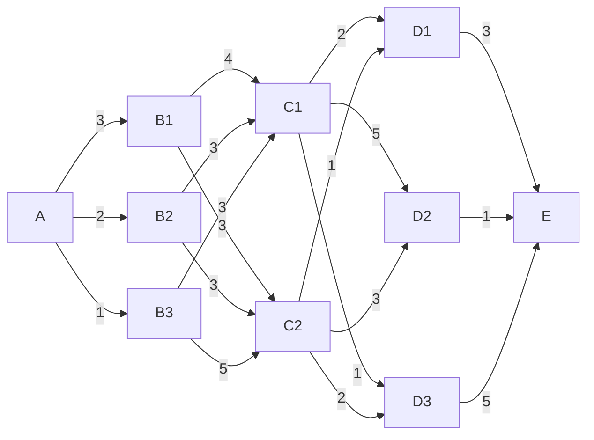

**Dynamic programing** is a mathematical optimization method that has found applications in numerous fields, such as aerospace engineering and economics. It usually refers to simplifying a decision by **breaking it down into a sequence of decision steps over time**. 
## Multi-stage optimization problem
We start with the **Iterative method**. The main iteration is: $$\begin{cases}f(i)=\min_j(c_{ij}+f(j)),&i=1,2,\cdots,N-1\\f(N)=0\end{cases}$$For instance, consider the following state transition graph:

The we can first write out $$f(D1)=3,\quad f(D2)=1,\quad f(D3)=5$$now utilize the iteration formula to move over to the $C$ column we get $$\begin{align}&f(C1)=\min_{j}(c_{1j}+f(D_j))=5\\&f(C2)=\min_j(c_{2j}+f(D_j))=4\end{align}$$similarly we proceeds as above, collapsing the graph on the right of any specific point into an individual optimal value $f(i)$, until the initial node is reached.
- **Application**: many different kinds of problems can be framed as a multistage optimization problem. For instance, we're given a set of items with the value set $v_i$ and the weight set $w_i$, if there is a total weight limit $w$, we can frame the decision as a multi-stage optimization by $$\begin{cases}f_k(y)=\max_{x_k=0,1}(v_kx_k+f_{k-1}(y-w_kx_k))\\f_1(y)=\begin{cases}v_1,&w_1\le y\\0,&w_1>y\end{cases}\end{cases}$$where the value function $f$ is given by $$f_k(y)=\max\Set{\sum_{i=1}^kv_ix_i:\sum_{i=1}^kw_ix_i\le y,x_i=0,1,\forall i}$$we'll take $y=w$ to initiate the iteration. To sum up, the multi-stage optimization is essentially completing a traversal of all possible solutions in a well-organized manner by incorporating one more item each time. 
- **Function iteration method**: sometimes the decision process cannot be organized into several separated stages, hence we instead go other the set of all possible solutions by steps of the path taken. The iteration of **function space** is like $$\begin{cases}f_{1}(i)=c_{iN},&1\le i\le N-1\\f_1(N)=0\end{cases}\quad\text{and}\quad\begin{cases}f_k(i)=\min_j(c_{ij}+f_{i-1}(j)),&1\le i\le N-1\\f_k(N)=0\end{cases}$$This iterates until all possible solutions are traversed.
- **Strategy iteration method**: a strategy $s(i)=j$ implies a path $p_i\to p_j$. Once initial strategy set $\set{s_0(i):1\le i\le N}$ is chosen (without loop) the iteration of **strategy space** is $$\begin{cases}f_0(i)=c_{is_0(i)}+f_0(s_0(i)),&1\le i\le N-1\\f_0(N)=0\end{cases}$$and after solving for $f_0(i)$ we try to update $$s_1(j)=\underset{j}{\arg\min}(c_{ij}+f_0(j))$$This repeats until the strategy converges, i.e., stays constant.